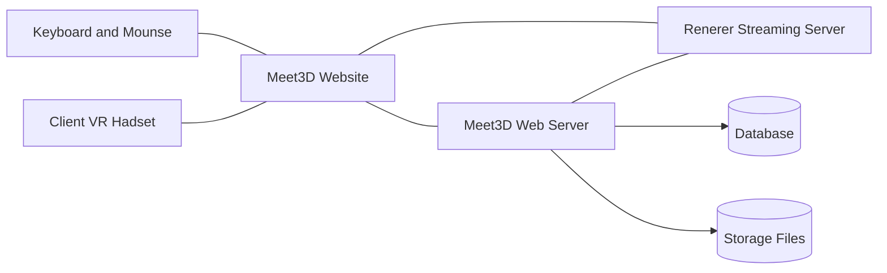
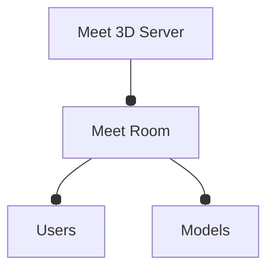

# Meet3D

# Project Architecture

```mermaid
flowchart LR
  DB[(Database)]
  Storage[(Storage Files)]

  Website[Meet3D Website]
  APIServer[Meet3D Web Server]
  RendererServer[Renerer Streaming Server]
  
  Controls[Keyboard and Mounse] & Client[Client VR Hadset] --- Website
  Website --- APIServer & RendererServer
  APIServer --- RendererServer
  APIServer --> DB & Storage
```

```mermaid
flowchart TD
  APIServer[Meet 3D Server] --o Room
  Room[Meet Room] --o RUsers & RModels["Models"]
  RUsers[Users]
```

# Links

# Authors

* Omer Priel
